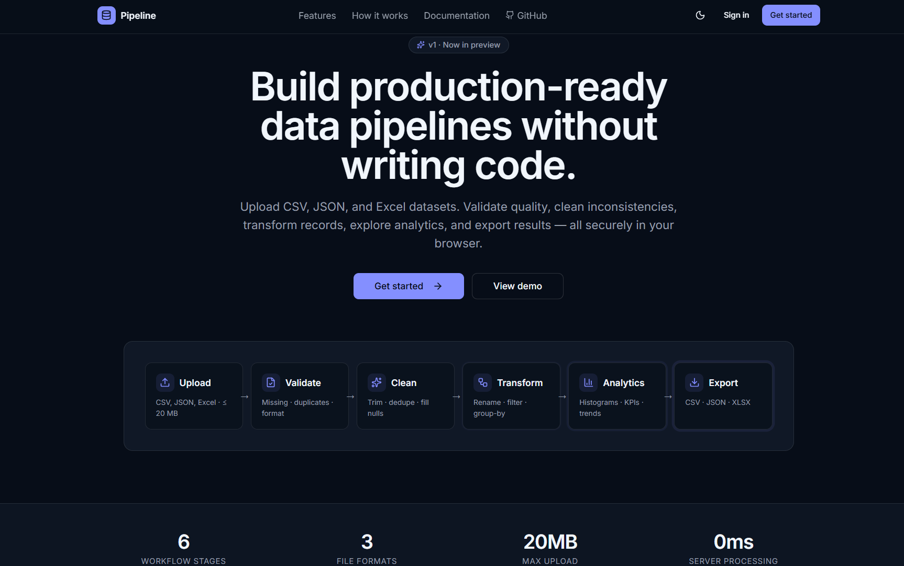
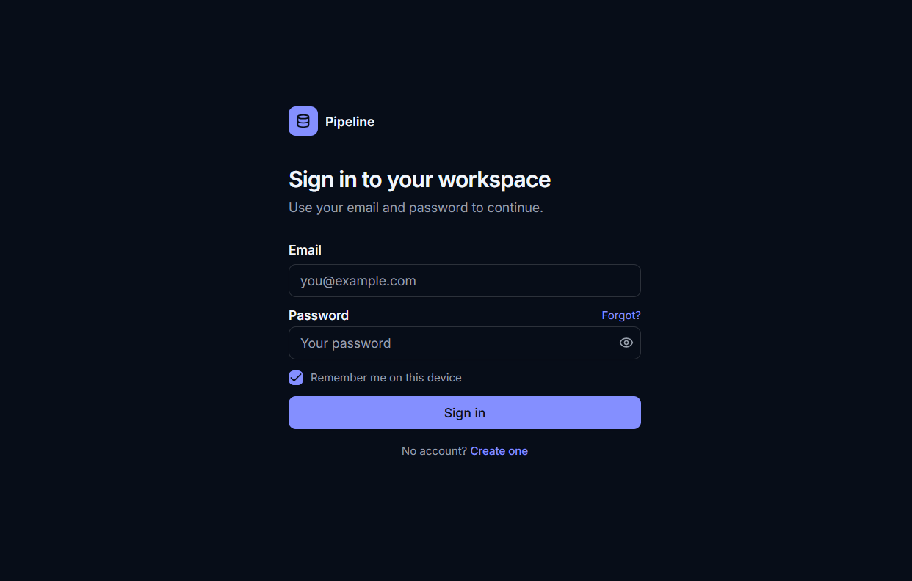
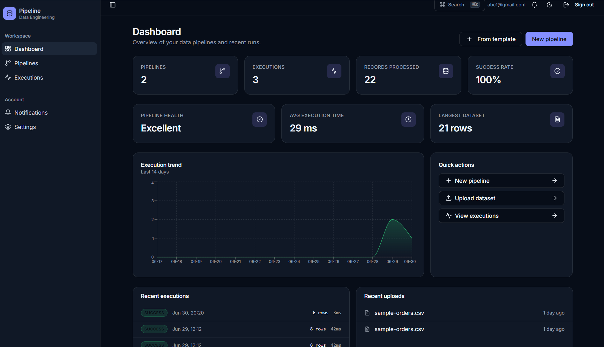
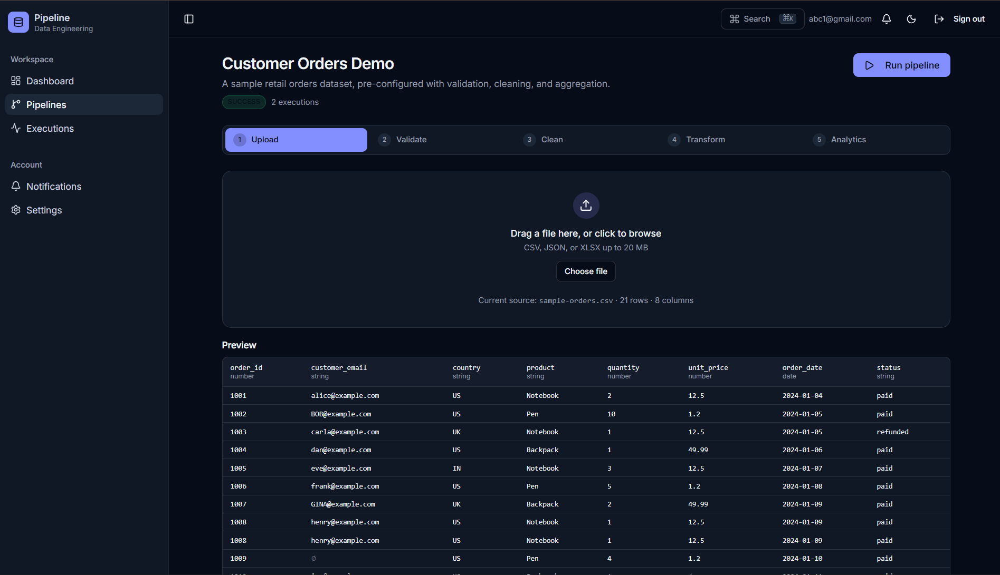
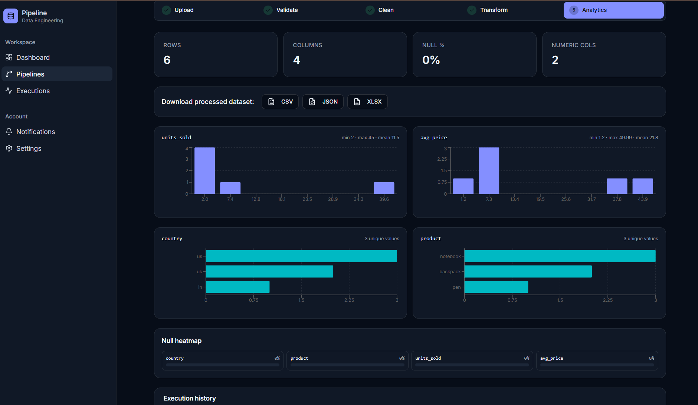
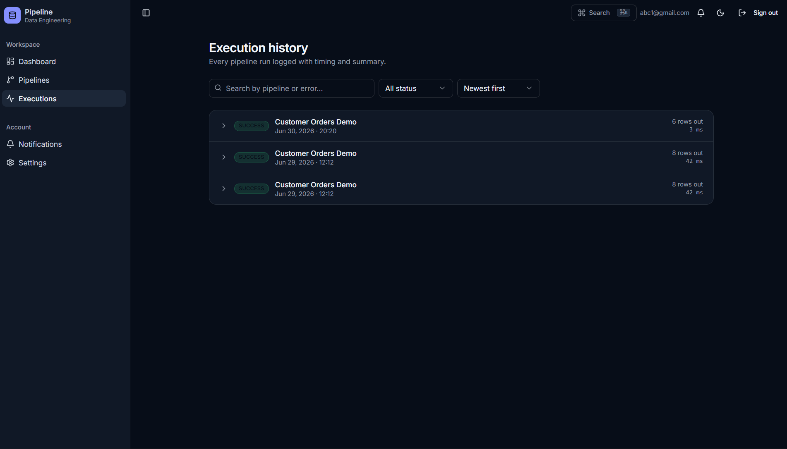
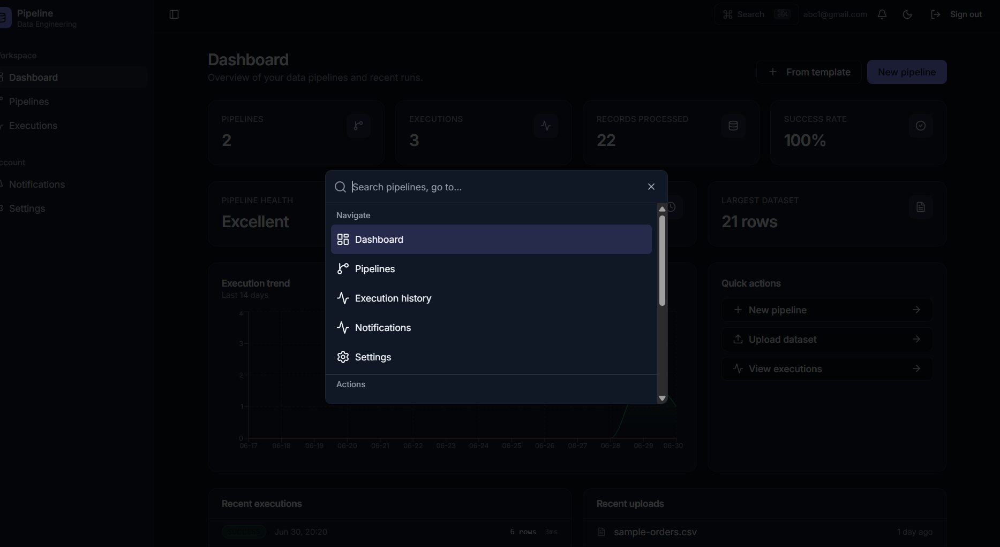

# Pipeline — Data Engineering Platform

<p align="center">
  <strong>Build production-ready data pipelines without writing code.</strong><br/>
  Upload · Validate · Clean · Transform · Analyze · Export — all securely in your browser.
</p>

<p align="center">
  
  
  
  
  
  
</p>

---

## Table of contents

1. [Overview](#overview)
2. [Features](#features)
3. [Architecture](#architecture)
4. [Database schema](#database-schema)
5. [Authentication flow](#authentication-flow)
6. [Pipeline flow](#pipeline-flow)
7. [Technology stack](#technology-stack)
8. [Folder structure](#folder-structure)
9. [Installation](#installation)
10. [Environment variables](#environment-variables)
11. [Screenshots](#screenshots)
12. [Security](#security)
13. [Performance](#performance)
14. [Testing](#testing)
15. [Deployment](#deployment)
16. [Roadmap](#roadmap)
17. [Contributing](#contributing)
18. [License](#license)
19. [Acknowledgements](#acknowledgements)
20. [Internship information](#internship-information)

---

## Overview

Pipeline is a self-serve data engineering SaaS that lets non-engineers build clean,
production-ready datasets through a guided 6-stage workflow. Files are parsed and
processed **entirely in the browser**, while metadata, pipeline definitions, and
processed exports are persisted to a private per-user workspace backed by
Supabase Postgres + Storage with row-level security.

## Features

- 🔐 **Email & Google sign-in** with private per-user workspaces.
- 📥 **Multi-format upload** — CSV, JSON, Excel (≤ 20 MB).
- ✅ **Validation** — missing values, duplicates, email / number / date / regex format checks.
- 🧹 **Cleaning** — deduplicate, trim, normalize case, fill nulls (mean / median / mode / constant), coerce types.
- 🔄 **Transformation** — rename columns, filter chains, group-by aggregations (sum / avg / count).
- 📊 **Analytics** — histograms, top categories, null heatmaps, KPI cards.
- 📤 **Export** — CSV, JSON, or XLSX back to private storage.
- 🗂️ **Templates** — Customer Orders, Sales, HR, Finance, Inventory, Marketing.
- 🛎️ **Notification center** with bell, history page, and category filters.
- ⌘ **Command palette** (`Cmd/Ctrl + K`) for global navigation.
- 🌗 **Light / Dark / System** themes, persisted per browser.
- 📜 **Execution history** with search, filters, sort, and expandable JSON.

## Architecture

```text
┌────────────────────────────────────────────────────────────────────┐
│                            Browser                                  │
│                                                                     │
│  ┌──────────────┐   ┌──────────────────┐   ┌────────────────────┐  │
│  │ TanStack     │   │ Pipeline engine  │   │ Recharts dashboards│  │
│  │ Router +     │◀─▶│ (validate/clean/ │◀─▶│ + Analytics views  │  │
│  │ React 19 UI  │   │ transform/exec)  │   │                    │  │
│  └──────┬───────┘   └────────┬─────────┘   └────────────────────┘  │
└─────────┼────────────────────┼──────────────────────────────────────┘
          │ HTTPS              │ Storage SDK (signed URLs)
          ▼                    ▼
┌─────────────────────┐  ┌──────────────────┐  ┌──────────────────┐
│  TanStack Start     │  │  Supabase Auth   │  │ Supabase Storage │
│  Server Functions   │  │  (Email + Google)│  │ (private buckets)│
│  (createServerFn)   │  └──────────────────┘  └──────────────────┘
└─────────┬───────────┘
          ▼
┌──────────────────────────────────────────────────────────────────┐
│                  PostgreSQL (Supabase)                            │
│  profiles · pipelines · pipeline_steps · datasets · executions    │
│  Row-Level Security scoped to auth.uid()                          │
└──────────────────────────────────────────────────────────────────┘
```

## Database schema

```text
┌─────────────┐        ┌──────────────┐        ┌────────────────┐
│  profiles   │        │  pipelines   │ 1   *  │ pipeline_steps │
│─────────────│        │──────────────│────────│────────────────│
│ id (PK)     │◀──┐    │ id (PK)      │        │ pipeline_id FK │
│ full_name   │   │    │ user_id FK   │        │ kind enum      │
│ created_at  │   │    │ name         │        │ config jsonb   │
└─────────────┘   │    │ status enum  │        │ order_index    │
                  │    │ description  │        └────────────────┘
                  │    └──────┬───────┘
                  │           │ 1
                  │           │
                  │     ┌─────▼──────┐         ┌────────────────┐
                  │     │  datasets  │         │   executions   │
                  │     │────────────│         │────────────────│
                  │     │ pipeline_id│         │ pipeline_id FK │
                  └─────│ user_id FK │         │ user_id FK     │
                        │ kind enum  │         │ status enum    │
                        │ schema jb  │         │ records_in/out │
                        │ row_count  │         │ duration_ms    │
                        │ storage_path│        │ summary jsonb  │
                        └────────────┘         └────────────────┘
```

All tables enforce **Row-Level Security** with policies of the form
`auth.uid() = user_id`. Storage buckets `raw-datasets` and `processed-datasets`
are private; clients access objects via short-lived signed URLs.

## Authentication flow

```text
   user                  app                  Supabase Auth
    │                     │                          │
    │── Email / Google ──▶│                          │
    │                     │── signUp / OAuth ───────▶│
    │                     │                          │── email verify (opt)
    │                     │◀── session JWT ──────────│
    │                     │                          │
    │◀── /dashboard ──────│ bearer attached to every server fn
```

- **Password reset:** `/auth/forgot` → email → `/auth/reset-password` (`supabase.auth.updateUser`).
- **Email verified screen:** `/auth/verified`.
- Authenticated routes live under `_authenticated/` and are gated by a
  client-side `beforeLoad` calling `supabase.auth.getUser()`.

## Pipeline flow

```text
  Upload ──▶ Validate ──▶ Clean ──▶ Transform ──▶ Analytics ──▶ Export
   CSV/JSON     missing     dedupe     rename       charts       CSV/JSON
   XLSX        duplicates   nulls      filters      KPIs         XLSX
   ≤ 20MB      format        trim      group-by                   to bucket
```

Each step is a pure function over a normalized `Table` (`columns[]` + `rows[]`).
The execution engine runs the configured steps in order, captures per-step
metrics (records in/out, duration, notes, errors), and persists a JSON
summary to `executions`.

## Technology stack

- **Frontend:** React 19, TypeScript (strict), TanStack Start v1, TanStack Router & Query, Tailwind CSS v4, shadcn/ui, Recharts, Lucide.
- **Parsing:** PapaParse (CSV), SheetJS / xlsx (Excel), native JSON.
- **Backend:** Supabase Postgres, Supabase Auth (Email + Google), Supabase Storage (private buckets), TanStack `createServerFn`.
- **Tooling:** Vite 7, num, ESLint, Prettier.

## Folder structure

```text
src/
├─ routes/                       # File-based routing
│  ├─ __root.tsx                 # Shell, providers, theme
│  ├─ index.tsx                  # Marketing landing
│  ├─ docs.tsx                   # Documentation
│  ├─ auth.tsx                   # Sign in / sign up
│  ├─ auth.forgot.tsx            # Forgot password
│  ├─ auth.reset-password.tsx    # Reset password
│  ├─ auth.verified.tsx          # Email verified
│  └─ _authenticated/            # Gated subtree
│     ├─ dashboard.tsx
│     ├─ pipelines.index.tsx
│     ├─ pipelines.$id.tsx
│     ├─ executions.tsx
│     ├─ notifications.tsx
│     └─ settings.tsx
├─ components/
│  ├─ theme/                     # ThemeProvider + ThemeToggle
│  ├─ notifications/             # Provider, bell, notify() helper
│  ├─ command/                   # ⌘K command palette
│  ├─ layout/                    # Sidebar + TopBar
│  ├─ pipeline/                  # Steppers, step screens, template picker
│  ├─ analytics/                 # Stat / KPI cards
│  └─ common/                    # Loading / Empty / Error states
├─ lib/
│  ├─ pipeline/                  # types · validate · clean · transform · execute · export
│  ├─ parse/                     # CSV / JSON / XLSX parsers
│  ├─ pipelines.functions.ts     # createServerFn: CRUD, clone, dashboard stats
│  ├─ executions.functions.ts    # createServerFn: history list
│  ├─ seed.functions.ts          # Demo-pipeline seed
│  ├─ storage.ts                 # Signed-URL upload helpers
│  ├─ file-validation.ts         # MIME + extension + size guard
│  ├─ templates.ts               # Pipeline templates catalog
│  └─ password.ts                # Strength heuristic
└─ integrations/supabase/        # Generated client + auth middleware
```

## Installation

```bash
# 1. Install
num install        # or: npm install

# 2. Start dev server (Vite on :8080)
num run dev        # or: npm run dev
```

## Environment variables

Configure these variables in your local .env file or deployment environment.. For self-hosted Supabase, set them in `.env`:

| Variable                          | Scope    | Purpose                                  |
| --------------------------------- | -------- | ---------------------------------------- |
| `VITE_SUPABASE_URL`               | Browser  | Public project URL                       |
| `VITE_SUPABASE_PUBLISHABLE_KEY`   | Browser  | Publishable (anon) key for the JS client |
| `SUPABASE_URL`                    | Server   | Used by server functions                 |
| `SUPABASE_PUBLISHABLE_KEY`        | Server   | Used by `requireSupabaseAuth`            |
| `SUPABASE_SERVICE_ROLE_KEY`       | Server   | Admin client (privileged work only)      |

## Screenshots

### Landing



### Authentication



### Dashboard



### Pipelines



### Analytics




### Executions



### Command Palette




## Security

- **Authentication** — Supabase Auth with email/password + Google OAuth via Supabase Authentication .
- **Row-Level Security** — every table enforces `auth.uid() = user_id`.
- **Private storage** — `raw-datasets` and `processed-datasets` buckets are private; only short-lived signed URLs are exposed.
- **File validation** — MIME + extension + 20 MB size guard before any parse.
- **No secret exposure** — service-role key is server-only; storage paths never rendered in the UI.

## Performance

- **In-browser processing** — zero server compute for parsing and transformation.
- **Code splitting** — Vite + TanStack Router split routes on demand.
- **TanStack Query** — request deduplication and stale-while-revalidate caching.
- **Recharts** — only mounted on analytics & dashboard routes.
- **Sorted & limited queries** — server fns cap result sets and order by index.

## Testing

```bash
# Type-check the whole project
num x tsgo --noEmit

# (Optional) Lint
num run lint
```

## Deployment

- Deploy using Vercel, Netlify, Cloudflare Pages, or your preferred hosting platform.
- Self-hosted: build with `num run build`, run `num run start`. Requires a Supabase project with the migrations in `supabase/migrations/` applied.

## Roadmap

- [ ] Server-backed notifications + email digests
- [ ] Multi-tenant workspaces & sharing
- [ ] Pipeline scheduling (Apache Airflow)
- [ ] Streaming ingestion (Apache Kafka)
- [ ] Large-dataset processing (Apache Spark)
- [ ] Cloud data warehouse sinks (BigQuery / Snowflake / Redshift)
- [ ] Granular role-based access control

## Contributing

1. Fork the repository.
2. Create a feature branch: `git checkout -b feat/awesome-thing`.
3. Make focused, well-typed commits.
4. Run `num x tsgo --noEmit` before opening a PR.
5. Submit a pull request.

## License

MIT © 2026 Pipeline contributors.

## Acknowledgements

- [shadcn/ui](https://ui.shadcn.com) — accessible component primitives.
- [TanStack](https://tanstack.com) — Router, Query, Start.
- [Supabase](https://supabase.com) — Postgres + Auth + Storage.
- [Recharts](https://recharts.org) — React chart library.
- [Lucide](https://lucide.dev) — icon set.

---

## Internship information

| Field      | Value                         |
| ---------- | ----------------------------- |
| **Intern** | Shuvankar Sahoo               |
| **ID**     | CITS2865                      |
| **Duration** | 6 weeks                     |
| **Project**  | Data Engineering Pipeline   |
